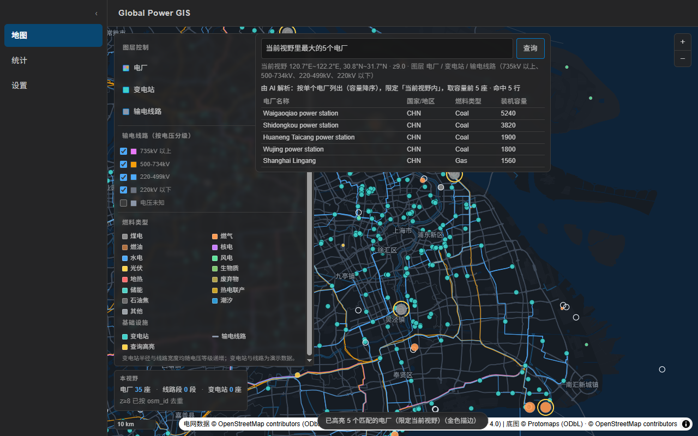
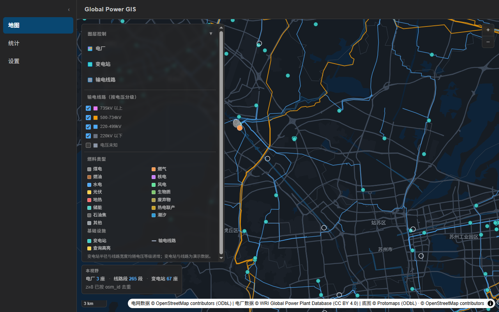

# Global Power GIS

全球电力基础设施 GIS 桌面应用 —— 面向全球电力设施地理数据的浏览、统计与分析。

## 当前阶段

**阶段31 —— 空间智能：AI 读懂「当前视野」**（2026-09-13）

已接入的能力：

- **地图**：离线 PMTiles 底图 + 本地中文字形（无网络也能出中文地名）
- **电网数据**：长三角真实 OSM 数据（22,380 条要素），本地切为 4.68 MB PMTiles 随安装包分发
- **电厂数据**：WRI Global Power Plant Database（34,936 行，内置种子库，首次启动自动播种）
- **图层控制**：`电厂 / 变电站 / 输电线路` 三个总开关；输电线路再按 `735kV 以上 / 500-734kV /
  220-499kV / 220kV 以下 / 电压未知` 五个原生复选框细分（**「电压未知」默认关闭**）
- **当前视野统计**：地图左下角实时显示「本视野：X 座电厂 · Y 段线路 · Z 座变电站」，
  `moveend` + 200ms 防抖；z≥8 按 `osm_id` 去重（精确），z<8 因归档未保留 `osm_id` 而标注为「按源统计」
- **空间智能问答**：地图页顶部浮动查询框（AI 配置与 CSV 导出仍在设置页），
  把**当前视野 bbox + 已选图层**作为上下文下发给大模型 / 本地规则引擎，
  于是「当前视野里最大的5个电厂」会真的按视野过滤；
  视野移动后旧结果（表格 + 地图高亮）自动清空，不会留下「地图飘走了、表格还停在原处」





取数与切片流程见 [`README_OSM.md`](./README_OSM.md)。

## 技术栈

| 层次 | 选型 |
| --- | --- |
| 桌面框架 | Tauri 2 |
| 前端框架 | React 19 |
| 语言 | TypeScript |
| 构建工具 | Vite 8 |
| 包管理器 | npm |

## 运行方式

### 前置要求

- **Node.js** —— `^20.19.0 || >=22.12.0`（Vite 8 的要求）
- **Rust 工具链**（Tauri 需要，含 `cargo`）
- **WebView2 Runtime**（Windows 10 / 11 通常已内置）

### 安装依赖

```bash
npm install
```

### 启动开发模式

```bash
npm run tauri dev
```

### 其他常用命令

| 命令 | 说明 |
| --- | --- |
| `npm run dev` | 只启动前端开发服务器（不含桌面外壳） |
| `npm run build` | 只构建前端产物到 `dist/` |
| `npm run tauri build` | 构建并打包桌面应用安装包 |
| `node scripts/fetch_basemap.mjs` | 生成离线底图（见下），**全新克隆后必须先跑一次** |
| `node scripts/fetch_glyphs.mjs` | 生成离线中文字形（见下），同上 |

### 离线底图（必做的前置步骤）

应用使用 Protomaps 的矢量底图（ODbL，需署名 OpenStreetMap）作为地图背景。

底图归档由脚本从公开的行星归档里**按需切出**，产物约 32 MB，属于可完整重建的派生产物，
因此**不进 Git**（见 `.gitignore`）。全新克隆后，在打包之前需要先执行：

```bash
node scripts/fetch_basemap.mjs --estimate-only   # 可选：只试算体积，不下瓦片
node scripts/fetch_basemap.mjs                   # 生成 src-tauri/resources/maps/basemap.pmtiles
```

- 默认范围：**全球 z0-z4**（全世界都有轮廓）+ **中国中东部 z5-z8**（bbox `98,18,128,46`）；
  用 `--bbox` / `--global-maxzoom` / `--region-maxzoom` / `--source` 可自行裁剪。
- 脚本依赖 `build.protomaps.com` 的 **HTTP Range** 支持：实测下载 1107 个瓦片只发了 37 次
  区间请求（合并边界 64 KB）。
- 前端通过 Tauri 的 **asset 协议**按需读取该文件（已验证返回 `206 Partial Content`）；
  实测「启动 + 拖动 + 放大」全过程只读取了 1.78 MB / 31.76 MB。
- 底图缺失时应用会正常启动，只显示纯色背景并给出提示，不会崩溃。

### 离线中文字形（必做的前置步骤）

底图地名用中文渲染，靠的是 MapLibre v6 的 **`font-faces`** 样式属性 —— 它把字体文件
交给浏览器的 CSS Font Loading API 本地绘制，**不需要任何字形（glyphs）服务器**：

- 样式中**完全不设 `glyphs`**。MapLibre 的 GlyphManager 在 glyphs 为空时会走本地绘制，
  因此一个字形请求都不会发出，真正离线。
  （顺带一提：Protomaps 官方字体资源里**没有 CJK**，其 CJK 码位区间返回的是空字形，
  所以本来也没有现成的中文字形服务器可用。）
- 字体取自 `@fontsource/noto-sans-sc`（按 unicode-range 切成 101 个子集）。
  `scripts/fetch_glyphs.mjs` 会先扫底图归档、统计 `places` 图层实际用到的码位，
  **只下载命中的子集**（实测 86 个 / 2.1 MB，全量约 4 MB）。
- `font-faces` 是**懒加载**的：只有某个字真的被画出来时才去取它所在的子集。
- 字体文件在 `public/fonts/`（已 gitignore）；生成的清单
  `src/lib/basemapFonts.generated.ts` 进 Git —— 缺字体时只会告警回退，不会崩。

### 目录结构

```
├─ index.html
├─ package.json
├─ vite.config.ts
├─ src/                     前端源码
│  ├─ App.tsx               应用入口
│  ├─ App.css               全局样式与深色主题配色令牌
│  ├─ components/           布局外壳
│  │  ├─ AppLayout.tsx      侧边栏 + 顶栏 + 内容区骨架
│  │  ├─ Sidebar.tsx        导航菜单（可折叠）
│  │  ├─ TopBar.tsx         标题栏
│  │  └─ GreetSelfCheck.tsx 前后端通信自检
│  └─ pages/                页面
│     ├─ MapPage.tsx        地图（纯 CSS 模拟底图）
│     ├─ StatsPage.tsx      统计（数值全部为 0）
│     └─ SettingsPage.tsx   系统设置（全部为禁用占位）
└─ src-tauri/               Tauri 后端
   ├─ tauri.conf.json       窗口 / 打包 / 安全配置
   ├─ capabilities/         权限声明
   ├─ icons/                应用图标
   └─ src/                  Rust 源码
```

## 已知限制

- **极少数地名仍会缺字** —— 阶段27 接入中文字形后的残留边界。
  - 现象：个别地名可能少一两个字，而不是整条标签不显示。
  - 原因：字形按需裁剪（见下方「离线中文字形」），我们只下载了
    `places` 图层实际用到的码位所命中的 86 个字体子集。
    实测 1766 个码位里有 **23 个没有任何子集覆盖**（缅甸文、泰文，以及一个
    CJK 扩展 B 区汉字），这些字无字形可用。
  - 已有缓解：标签回退链是 `name:zh-Hans → name:zh-Hant → name:en → name`，
    所以绝大多数情况会退回英文而不是显示空白。
- **离线底图有覆盖范围**：全球 z0-z4 + 中国中东部（bbox `98,18,128,46`）z5-z8。
  该范围之外放大到 z5 以上只是把 z4 瓦片 overzoom —— 矢量放大不会糊，但细节不再增加。
- **全新克隆后必须先跑两个生成脚本才能打包**（产物都不进 Git，见下）：
  ```bash
  node scripts/fetch_basemap.mjs   # 离线底图，约 32 MB
  node scripts/fetch_glyphs.mjs    # 离线中文字形，约 2.1 MB
  ```

## 说明

- 界面为**固定深色主题**，不跟随系统浅色模式
- 当前不含任何真实数据，统计数值均为 `0`，设置项均为禁用占位
- 应用图标为手写 SVG 生成的占位图标，后续可替换为正式品牌图标
