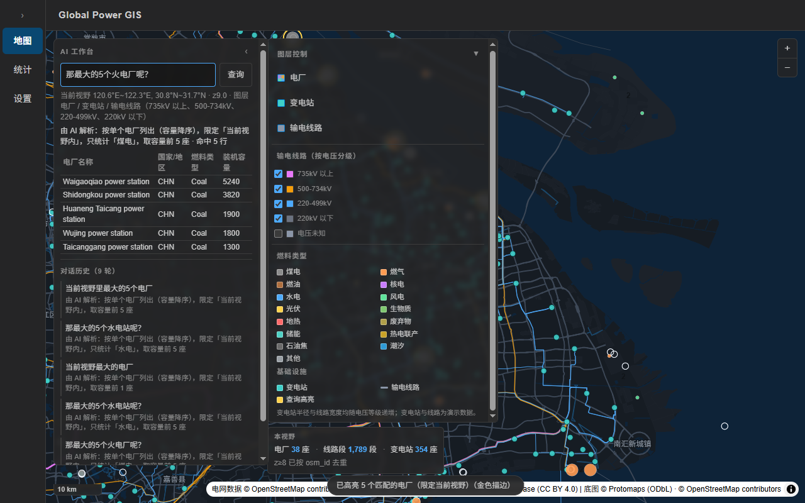
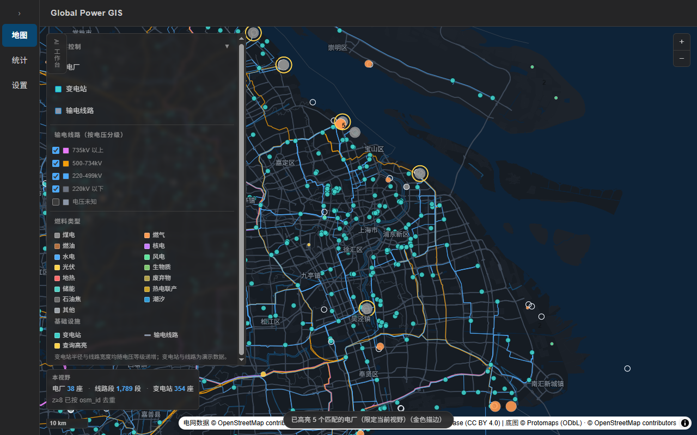

# Global Power GIS

全球电力基础设施 GIS 桌面应用 —— 面向全球电力设施地理数据的浏览、统计与分析。

## 当前阶段

**阶段55 —— 发布前体检：发现「GEM 包从未上传」，并补上数据包校验**（2026-09-18，v0.2.0）

- 🔴 体检实测：Release `v1.0-packs` **只有 7 个区域包，`gem-plants.pmtiles` 从未上传**，
  而清单照样给它写了下载地址 ⇒ **新装用户点「GEM Plants」必然失败**
  （开发机复现不了：本机那个文件是脚本**投放**的，不是下载来的）。
  ⏳ **待执行：上传该资产**（手册：[`docs/PACKS_UPLOAD_RUNBOOK.md`](./docs/PACKS_UPLOAD_RUNBOOK.md)）
- 🆕 `scripts/verify_packs.mjs` —— 清单 vs **本地磁盘** vs **远端 Release 资产**三方校验；
  「缺哪个包」直接点名。**发布前必跑**，见下方「文档约定」
- 🆕 `docs/PACKS_UPLOAD_RUNBOOK.md` —— 数据包上传与复核手册（gh CLI / 网页 / REST 三条路）
- 清掉 `bundle\nsis\` 里阶段50 遗留的 `0.1.0` 安装包，并重打 0.2.0
  （对齐上一阶段漏进产物的 `lang="zh-CN"`）

### 阶段54（上一阶段）

**阶段54 —— 修补批次：权限收敛 / 图层溢出 / 投放脚本 / 文档治本**（2026-09-18，v0.2.0）

本阶段做了什么（都是「修补」，不是新功能）：

- **CSV 导出的写盘动作下沉到 Rust** —— 顺带删掉 `fs:write-all` 这条过宽权限
  （前端原本可以在任意路径写文件），前端也不再需要任何文件插件
- **修「图层控制」的溢出** —— 「输电线路（按电压分级）」改为可折叠，
  1280×800 下默认路径从**溢出 65px 变成 0**
  （⚠️ 旧文档记的「11px」是阶段52 布局改动前的数，已作废）
- **修数据包投放脚本的两个盲区** —— 此前 `gem-plants.pmtiles` 永远投放不了，
  且没有一条路径能投到运行时优先级最高的**用户目录**
- **文档治本** —— 见下方「文档约定」

阶段53 完成：数据包下载**多源降级**（镜像失败自动切直连）。

### 文档约定（阶段54 起执行）

> **凡是写进文档的数字，都要能立刻用一条命令验证；不能验证的，就别写进去。**

以下三类是**易失状态**，每做一次提交 / 每清一次目录就过时一次，因此
**禁止**写进文档正文，一律给出查询命令：

| 易失状态 | 现查命令 |
|---|---|
| 当前提交、领先/落后 origin 几个提交 | `D:\Git\cmd\git.exe log --oneline -3`（见 `PROJECT_HANDOFF.md` §9） |
| 本机装了哪些数据包 | `node scripts/install_packs.mjs --list` |
| **数据包是否真的都在远端**（清单说得对 ≠ 用户下得到） | `node scripts/verify_packs.mjs --remote` |
| 产物里有没有混进开发期地址 / 调试端口 | `node scripts/check_release_redlines.mjs --with-exe` |
| 构建产物的版本与体积 | `Get-ChildItem src-tauri\target\release\bundle\nsis\*.exe \| Select-Object Name,Length,LastWriteTime` |
| 工具链绝对路径 | 见 `PROJECT_HANDOFF.md` §9 的环境自检 |

**为什么定这条规矩**：阶段54 体检时发现 10 处文档与仓库不一致，其中
「HEAD 是 `3219cef`、领先 origin 3 个提交」「本机已有 4 个数据包」这两条
在写下后的**一天内**就失效了。逐条改数字只能撑到下一次提交 —— 所以要改的是
**记录什么**，而不是记录得准不准。

已接入的能力：

- **地图**：离线 PMTiles 底图 + 本地中文字形（无网络也能出中文地名）
- **电网数据**：长三角真实 OSM 数据（25,611 条**电力要素**），本地切为 **5.79 MiB** PMTiles 随安装包分发
  （阶段56-A1 撤销了阶段43 加入的铁路/油气管道，体积由 7.49 MiB 回落）
- **电厂数据**：WRI Global Power Plant Database（34,936 行，内置种子库，首次启动自动播种）
- **GEM 发电设施**（阶段48-A 引入，阶段50 改为 PMTiles 数据包）：Global Energy Monitor
  的三份机组级 tracker（GCPT 煤电 / GOGPT 油气 / GBPT 生物质），
  **33,790 机组聚合为 14,793 座电站**（煤炭 4,865 / 油气 6,390 / 生物质 3,538），
  含全生命周期（在运 / 拟建在建 / 已退役 / 已取消）。**不随安装包分发** ——
  作为 `packs/gem-plants.pmtiles`（7.07 MB）按需下载；独立于 WRI 的**实心彩色圆**叠加层
  （按 `plant_type` 三色），**默认关闭**。⚠️ **仅覆盖煤炭 / 油气 / 生物质三类** ——
  风 / 光 / 水 / 核 / 储不在 GEM 开放 API 里（只在其需填表申请的 GIPT 中）。
  详见下文「数据来源与许可」
- **图层控制**：`电厂 / 变电站 / 输电线路` 三个总开关；输电线路再按 `735kV 以上 / 500-734kV /
  220-499kV / 220kV 以下 / 电压未知` 五个原生复选框细分（**「电压未知」默认关闭**）
- **当前视野统计**：地图左下角实时显示「本视野：X 座电厂 · Y 段线路 · Z 座变电站」，
  `moveend` + 200ms 防抖；z≥8 按 `osm_id` 去重（精确），z<8 因归档未保留 `osm_id` 而标注为「按源统计」
- **空间智能问答**：地图页顶部浮动查询框（AI 配置与 CSV 导出仍在设置页），
  把**当前视野 bbox + 已选图层**作为上下文下发给大模型 / 本地规则引擎，
  于是「当前视野里最大的5个电厂」会真的按视野过滤；
  视野移动后旧结果（表格 + 地图高亮）自动清空，不会留下「地图飘走了、表格还停在原处」
- **多轮对话记忆**：追问「那最大的5个水电站呢？」会继承上一轮的地理框架，只替换用户显式改写的部分。
  实测追问 SQL 仍带 `lon/lat BETWEEN ? AND ?`；对照 Python 独立复核：视野内 Hydro 计数 = 0（全库 7156 条），
  即「0 行」是地域约束生效的真值，而非数据缺失
  （本地 `qwen2.5:7b` 在追问时经常不输出 `inViewport`，因此在 LLM 路径补了一条确定性继承规则：
  指代词 + 上一轮带视野 + 本轮未换国家 → 继承上一轮视野）
- **左侧智能工作台**：地图页查询框改为可折叠工作台（折叠后只剩竖向导轨，图层面板随之归位），
  显示「对话历史（N 轮）」与每条问/AI 解析，默认最近 5 轮 + 展开更多（最多保留 20 轮）；
  新查询发起瞬间旧表格与地图高亮立即清空，不留视觉残留





## 分发包

安装包：`src-tauri/target/release/bundle/nsis/Global Power GIS_0.2.0_x64-setup.exe`

> 📌 **体积与 SHA256 属易失状态，本正文不再写死**（阶段55 定）。
> 理由是阶段54/55 连着踩了两次：写下后一次重打包就过期，而过期数字之间还会「互相印证」。
> 现查（复制即用）：
>
> ```powershell
> Get-ChildItem src-tauri\target\release\bundle\nsis\*.exe |
>   Select-Object Name, Length, LastWriteTime
> (Get-FileHash "src-tauri\target\release\bundle\nsis\Global Power GIS_0.2.0_x64-setup.exe" -Algorithm SHA256).Hash
> Get-Item src-tauri\target\release\global-power-gis.exe | Select-Object Length, LastWriteTime
> ```

- 安装包为 NSIS、中文安装界面，`installMode: currentUser`
- 裸主程序约 **9.5 MiB** 量级；其余为关键资源的 LZMA 压缩后体积
- 🔴 **预算红线 50 MB** —— 这是**稳定值**，不是实测值，量体积时拿它当判据

> 🔎 **体积归因的历史教训（别用增量互推）**：阶段54 时裸主程序**大了 0.20 MiB**
> （9.26 → 9.46 MiB，dialog 插件 + `export.rs`），而安装包反而**小了 0.42 MB**（46.54 → 46.12）。
> ⇒ 两者方向相反是正常的：资源段的 LZMA 压缩率与前端 bundle 大小都会影响最终结果。
> 要结论就重新打包量一次。
>
> ✅ 阶段55 重打包后：`bundle\nsis\` 里**只剩当前版本**一个包
> （阶段50 遗留的 `0.1.0` 已删除）；但 NSIS 是**追加**而非替换，**下次重打包后仍要人工确认一次**。

关键资源随包分发（可核：`src-tauri/target/release/nsis/x64/installer.nsi` 里的 `File /a` 指令）：

| 资源 | 安装后位置 | 体积 |
|---|---|---|
| 离线底图 PMTiles | `maps\basemap.pmtiles` | 31.77 MB |
| 长三角 OSM 电网切片 | `maps\osm_grid.pmtiles` | 5.79 MiB |
| 数据种子库（仅 WRI 电厂 34,936 行） | `seed\global_power_gis.db` | 9.00 MB |

> 种子库在阶段48-A 曾因 GEM 机组级数据从 7.76 MB 涨到 13.86 MB；**阶段50–51 把 GEM 移出种子库**
> （改走可下载的数据包，见下方「GEM 的运行架构」）后回落到 **9.00 MB（−4.86 MB）**。
> 参考：当初那 +6.10 MB 只让安装包涨了 0.82 MB（45.72 → 46.54）—— 数据库走 LZMA 后压缩率很高，
> 所以「种子库大小」与「分发包膨胀」不是一回事，评估体积时别直接相加。

**GEM 的运行架构**（阶段50 起 —— **不进安装包，也不进 SQLite**）：

| 项 | 值 |
|---|---|
| 数据包 | `GEM Plants` — `packs/gem-plants.pmtiles`（7.07 MB，按需下载） |
| 清单条目 | `{ key: "gem", kind: "gem", label: "GEM Plants" }` |
| MapLibre source | `gem-pmtiles` —— **PMTiles vector source**（`pmtiles://` 协议） |
| `source-layer` | `gem` |
| MapLibre layer | `gem-plants` —— 单一 circle 图层，**默认关闭** |

> 🔴 **阶段55 体检发现（已知断点，随手可修）**：`gem-plants.pmtiles` **从未上传到
> Release `v1.0-packs`**（该 Release 建于 2026-09-14，早于阶段50 的 GEM 打包方案，
> 此后只补过 7 个区域包）。而清单照样给它写了 `downloadUrl`，所以
> **新装用户点「GEM Plants」会去下载一个不存在的文件**。
>
> 这个断点**在开发机上永远复现不了**：本机的 `gem-plants.pmtiles` 是
> `install_packs.mjs --user-dir` **投放**的，不是下载来的。
>
> - 现查：`node scripts/verify_packs.mjs --remote`（会直接点名缺哪个资产）
> - 修法：见 [`docs/PACKS_UPLOAD_RUNBOOK.md`](./docs/PACKS_UPLOAD_RUNBOOK.md)
> - ✅ **上传后请删掉本条**（含 `PROJECT_HANDOFF.md` §8 的对应条目）——
>   它记录的是一个**待修状态**，修好之后留着就是过期信息。

**三项全离线**：底图与电网切片来自安装目录（本地 `asset` 协议）、电厂数据来自 SQLite 种子库
（首启播种到 `%APPDATA%\com.pstar119.globalpowergis\global_power_gis.db`）、自然语言查询走本机 Ollama。

> 设置页自检显示 `substations 0 / transmission_lines 0` **属正常**：这两张表是早期演示数据，
> 阶段29 起的真实电网数据在 PMTiles 切片里，不再入库。

### ⚠️ 生产包使用本地 Ollama 的前提（实测踩到的唯一一坑）

生产版前端源是 `http://tauri.localhost`，而 Ollama 默认只放行 `localhost / 127.0.0.1` 这类源，
于是「测试连接」会报 `Failed to fetch`。实测对照（同一个 Ollama，只换 Origin）：

| Origin | 结果 |
|---|---|
| `http://localhost:1420`（dev） | `200` + `Access-Control-Allow-Origin: http://localhost:1420` |
| `http://tauri.localhost`（生产） | **`403 已禁止`** |

放行方式（无需管理员权限，可随时改回）：

```powershell
[System.Environment]::SetEnvironmentVariable('OLLAMA_ORIGINS',
  'http://tauri.localhost,http://localhost:*,http://127.0.0.1:*','User')
```

设完**必须重启 Ollama**（托盘图标退出后重新打开）才生效。
注意这不是本项目代码缺陷，也**不是 CSP 问题** —— 被 CSP 拦会报 `Refused to connect`。

### 安装包红线自检（**扫 dist**，不是只扫 exe）

```powershell
node scripts/check_release_redlines.mjs --with-exe
```

🔴 **阶段55 更正了一条此前不可靠的做法**：原来只在**裸 exe 里搜字符串**，
但那**证明不了前端有没有被污染** —— Tauri 在 release 构建里把前端资源
**Brotli 压缩**后嵌入二进制，所以 bundle 里的任何字符串都**不会**以明文出现，
**无论它有没有被污染**。实测（阶段55，同一份产物）：

| 事实 | 证据 |
|---|---|
| 前端 bundle 里确有「localhost:11434」「最大」等字样 | `dist/assets/index-*.js` 里可搜到 |
| 同一个 exe 里搜这些字样 | **全部未命中**（被压缩了） |
| exe 里却能搜到 `lang="en"` | ⚠️ **假阳性**：来自 **Brotli 内置静态字典**（周围是 `that isLibraryhusbandin factaffairs…` 词表），**不是**我们的 `index.html` |

⇒ 结论：**前端的东西在 `dist/` 里查，Rust 的东西才在 exe 里查**。
`dist/` 是「会被嵌入二进制的那份内容」的唯一真源，而 `scripts/check_release_redlines.mjs`
就是按这个作用域写的。

它同时带**对照串**（这是让绿灯有意义的关键，阶段54 的教训）：
`localhost:11434`（Ollama 默认地址）在 dist 里必须命中，
`export_csv_file` / `tauri.localhost` 在 exe 里必须命中 —— 全都不命中说明「搜错了地方」。

<details>
<summary>历史记录：阶段54 那条 exe 搜索的原始实测（<b>仅对 Rust 侧字符串有效</b>）</summary>

```powershell
$exe   = (Get-Item src-tauri\target\release\global-power-gis.exe).FullName
$bytes = [System.IO.File]::ReadAllBytes($exe)
$latin = [System.Text.Encoding]::GetEncoding(28591).GetString($bytes)   # latin1：字节↔字符一一对应
foreach ($k in @('127.0.0.1:8099','9222','remote-debugging','api_key=')) {
  "{0,-22} {1}" -f $k, $(if ($latin.Contains($k)) { '命中 ❌' } else { '未命中 ✅' })
}
```

> 🔴 **别再用 `Select-String -Encoding Byte`** —— PowerShell 5.1 的 `-Encoding` 不接受
> `Byte`，命令会**直接报错**，而报错时它一行都不输出，看起来就像「全部未命中」。
> 这是个会让人拿到假通过的坑（阶段54 实测踩到）。
>
> ⚠️ 另：`additionalBrowserArgs` 此前被记为「命中但无害」（Tauri 给 WebView2 传
> `--disable-features=…` 的字段名，本项目未配置该项）。它不是泄漏项，留作历史记录。
</details>

打包注意：`target/release` 从零重建时，实时防护会偶发抢占新产物，报
`link.exe` / `icu_properties_data` 的 `拒绝访问 (os error 5)`，**原样重试一次即过**（实测）。

> ℹ️ 另有一条**无害**的链接器警告：`正在创建库 …global_power_gis_lib.dll.lib 和对象 …dll.exp`
> —— 这是 `crate-type` 含 `cdylib`/`staticlib` 时的正常产物（供移动端复用），
> 不是错误，阶段54 打包时出现过。

取数与切片流程见 [`README_OSM.md`](./README_OSM.md)。

## 数据来源与许可

本项目内置的数据集**全部为开放许可**，各自的要求均已在界面上落地，不能随意删除或改写。

### Global Energy Monitor —— CC BY 4.0

GEM 发电设施（`GEM Plants`）—— **Global Energy Monitor 数据来源说明**：数据来自其三份
机组级 tracker（GCPT 煤电 / GOGPT 油气 / GBPT 生物质），均以
**Creative Commons Attribution 4.0 International（CC BY 4.0）**发放。

- 许可正文：<https://globalenergymonitor.org/creative-commons-license/>
  （⚠️ 旧地址 `/terms-of-use/` 已 **404**，不要再用）
- 数据集主页：<https://globalenergymonitor.org/projects/global-integrated-power-tracker/>
- 抓取接口：`https://api.globalenergymonitor.org/assets?asset_type=<type>`
  （`<type>` ∈ `coal-plant` / `oil-gas-plant` / `bioenergy-plant`；公开、无需鉴权；
  `limit` 上限 **500**，超了返回 422）
- 推荐引用（**煤电 GCPT**）：
  > © Global Energy Monitor. Global Coal Plant Tracker, January 2026 release.
  > Distributed under a Creative Commons Attribution 4.0 International License.

> ⚠️ 油气（GOGPT）与生物质（GBPT）是**独立 tracker**、各有自己的推荐引用（见许可正文页面）。
> 本项目 GEM 数据**含三者**，此处只转录煤电那一条，**不代 GEM 拟写**其余两条。

CC BY 4.0 允许复制、再分发与改编（§2），且 §4 明确覆盖数据库权利 —— 可以提取、
再利用乃至再分发**全部或实质性部分**。**唯一义务是署名**，本项目在三个位置同时落实：

| 位置 | 内容 |
|---|---|
| 地图右下版权区 | `GEM 发电设施 © Global Energy Monitor CC BY 4.0`（挂在数据源 `attribution` 上）|
| 电厂弹窗 | 「数据来源 Global Energy Monitor (CC BY 4.0)」，**可点击**跳转许可页 |
| 源代码 | `scripts/archive/import_gem_coal_legacy.py`（原 `scripts/import_gem_coal.py`）与迁移 `008_add_gem_coal_plants.sql` 头部 |

⚠️ 网站页脚的 `© 2026 Global Energy Monitor / All Rights Reserved` 是**网站自身**的版权，
**不是数据集**的许可。核实许可以上述 CC BY 4.0 页面为准。

### 其它数据源

| 数据 | 来源 | 许可 | 署名位置 |
|---|---|---|---|
| 全球电厂 | WRI Global Power Plant Database | CC BY 4.0 | 数据源 attribution + 弹窗 |
| 电网设施 | OpenStreetMap contributors | ODbL | 数据源 attribution |
| 离线底图 | Protomaps（基于 OSM） | ODbL | 数据源 attribution |

### 刷新 GEM 数据

⚠️ **阶段50 起 GEM 不再有 SQLite 通道**。旧脚本已归档为
`scripts/archive/import_gem_coal_legacy.py`（阶段51-A）—— 它写入的 `gem_coal_plants`
表已被**迁移 009** 删除，**该脚本现已无法运行**（误跑会抛 `ImportAbort`，不会写坏数据）。

现在的刷新链路是「抓取 → GeoJSON → pmtiles → 数据包」（各脚本头部有完整说明）：

```text
scripts/import_gem_plants.py     抓取三类电源，产出电站级 GeoJSON
scripts/build_pmtiles.mjs        用 --kind gem 切成 packs/gem-plants.pmtiles
scripts/gen_packs_manifest.mjs   刷新清单里的 sizeMb / sha256 / bytes
```

（归档脚本当初的两个性质记录在此以便追溯：只用 Python 标准库 `urllib`、**不引入任何
第三方依赖**；并做完整性硬校验 —— 抓到的条数不等于接口声明的 `total` 就中止且**不写库**。）

## 技术栈

| 层次 | 选型 |
| --- | --- |
| 桌面框架 | Tauri 2 |
| 前端框架 | React 19 |
| 语言 | TypeScript |
| 构建工具 | Vite 8 |
| 包管理器 | npm |
| 文件对话框 | 原生「另存为」由 **Rust 侧** `tauri-plugin-dialog` 提供 —— 前端**不装**任何文件插件 |

### 关于依赖

项目长期执行「**零新增依赖**」原则，**阶段52 曾破例**，**阶段54 已把破例收窄**：

| 阶段 | 依赖 | 现状 |
|---|---|---|
| 52 破例 | `@tauri-apps/plugin-dialog` / `tauri-plugin-dialog` | 🟡 **前端那一半已删**，cargo 侧保留（Rust 拿它弹原生对话框） |
| 52 破例 | `@tauri-apps/plugin-fs` / `tauri-plugin-fs` | ✅ **已删**（npm + cargo 直接依赖 + `fs:write-all` 权限） |

破例的原始理由：CSV 导出必须让用户自选保存位置，浏览器原生 `<a download>` 只能写到
系统默认下载目录，无法满足。

**阶段54 为什么要再动它**：`plugin-fs` 带来的 `fs:write-all` 是「前端任意脚本可写任意
路径」，且**无法用 `fs:scope` 收紧**（用户要自选位置，白名单不可能预先知道）。
把「选路径 + 写盘」整体搬到 Rust 后，**路径不再经过前端**，权限随之删除。

> ⚠️ 这里有个容易做错的「简化」：让前端弹完对话框、把路径传给 Rust 写 ——
> 那样前端仍能构造任意路径，只是把 `fs:write-all` 换了个名字，**不是真的收敛**。
> 细节见 `src-tauri/src/export.rs` 头部。

> 🔴 顺带更正一个容易高估的收益：`tauri-plugin-fs` 是 `tauri-plugin-dialog` 的
> **传递依赖**，删掉直接依赖后它**照样被编译进二进制** ⇒ 本次**不省体积**，
> 收益是**权限收敛**。

⚠️ 这些是**先例，不是「可以随便加」**。后续任何新增依赖仍需单独授权。

## 运行方式

### 前置要求

- **Node.js** —— `^20.19.0 || >=22.12.0`（Vite 8 的要求）
- **Rust 工具链**（Tauri 需要，含 `cargo`）
- **WebView2 Runtime**（Windows 10 / 11 通常已内置）

### 安装依赖

```bash
npm install
```

### 启动开发模式

```bash
npm run tauri dev
```

### 其他常用命令

| 命令 | 说明 |
| --- | --- |
| `npm run dev` | 只启动前端开发服务器（不含桌面外壳） |
| `npm run build` | 只构建前端产物到 `dist/` |
| `npm run tauri build` | 构建并打包桌面应用安装包 |
| `node scripts/fetch_basemap.mjs` | 生成离线底图（见下），**全新克隆后必须先跑一次** |
| `node scripts/fetch_glyphs.mjs` | 生成离线中文字形（见下），同上 |

### 离线底图（必做的前置步骤）

应用使用 Protomaps 的矢量底图（ODbL，需署名 OpenStreetMap）作为地图背景。

底图归档由脚本从公开的行星归档里**按需切出**，产物约 32 MB，属于可完整重建的派生产物，
因此**不进 Git**（见 `.gitignore`）。全新克隆后，在打包之前需要先执行：

```bash
node scripts/fetch_basemap.mjs --estimate-only   # 可选：只试算体积，不下瓦片
node scripts/fetch_basemap.mjs                   # 生成 src-tauri/resources/maps/basemap.pmtiles
```

- 默认范围：**全球 z0-z4**（全世界都有轮廓）+ **中国中东部 z5-z8**（bbox `98,18,128,46`）；
  用 `--bbox` / `--global-maxzoom` / `--region-maxzoom` / `--source` 可自行裁剪。
- 脚本依赖 `build.protomaps.com` 的 **HTTP Range** 支持：实测下载 1107 个瓦片只发了 37 次
  区间请求（合并边界 64 KB）。
- 前端通过 Tauri 的 **asset 协议**按需读取该文件（已验证返回 `206 Partial Content`）；
  实测「启动 + 拖动 + 放大」全过程只读取了 1.78 MB / 31.76 MB。
- 底图缺失时应用会正常启动，只显示纯色背景并给出提示，不会崩溃。

### 离线中文字形（必做的前置步骤）

底图地名用中文渲染，靠的是 MapLibre v6 的 **`font-faces`** 样式属性 —— 它把字体文件
交给浏览器的 CSS Font Loading API 本地绘制，**不需要任何字形（glyphs）服务器**：

- 样式中**完全不设 `glyphs`**。MapLibre 的 GlyphManager 在 glyphs 为空时会走本地绘制，
  因此一个字形请求都不会发出，真正离线。
  （顺带一提：Protomaps 官方字体资源里**没有 CJK**，其 CJK 码位区间返回的是空字形，
  所以本来也没有现成的中文字形服务器可用。）
- 字体取自 `@fontsource/noto-sans-sc`（按 unicode-range 切成 101 个子集）。
  `scripts/fetch_glyphs.mjs` 会先扫底图归档、统计 `places` 图层实际用到的码位，
  **只下载命中的子集**（实测 86 个 / 2.1 MB，全量约 4 MB）。
- `font-faces` 是**懒加载**的：只有某个字真的被画出来时才去取它所在的子集。
- 字体文件在 `public/fonts/`（已 gitignore）；生成的清单
  `src/lib/basemapFonts.generated.ts` 进 Git —— 缺字体时只会告警回退，不会崩。

### 目录结构

```
├─ index.html
├─ package.json
├─ vite.config.ts
├─ src/                     前端源码
│  ├─ App.tsx               应用入口
│  ├─ App.css               全局样式与深色主题配色令牌
│  ├─ components/           布局外壳
│  │  ├─ AppLayout.tsx      侧边栏 + 顶栏 + 内容区骨架
│  │  ├─ Sidebar.tsx        导航菜单（可折叠）
│  │  ├─ TopBar.tsx         标题栏
│  │  └─ GreetSelfCheck.tsx 前后端通信自检
│  └─ pages/                页面
│     ├─ MapPage.tsx        地图（MapLibre GL + 瓦片底图 + OSM 电力图层）
│     ├─ StatsPage.tsx      统计（真实数据：电厂数 / 总容量 / 国家 / 燃料）
│     └─ SettingsPage.tsx   系统设置（仍为禁用占位）
└─ src-tauri/               Tauri 后端
   ├─ tauri.conf.json       窗口 / 打包 / 安全配置
   ├─ capabilities/         权限声明
   ├─ icons/                应用图标
   └─ src/                  Rust 源码
```

## 已知限制

- **极少数地名仍会缺字** —— 阶段27 接入中文字形后的残留边界。
  - 现象：个别地名可能少一两个字，而不是整条标签不显示。
  - 原因：字形按需裁剪（见下方「离线中文字形」），我们只下载了
    `places` 图层实际用到的码位所命中的 86 个字体子集。
    实测 1766 个码位里有 **23 个没有任何子集覆盖**（缅甸文、泰文，以及一个
    CJK 扩展 B 区汉字），这些字无字形可用。
  - 已有缓解：标签回退链是 `name:zh-Hans → name:zh-Hant → name:en → name`，
    所以绝大多数情况会退回英文而不是显示空白。
- **变电站 / 电厂圆点已可点选**（阶段41 修复）。
  - 统一走地图级回调 `showOsmPointOrLine()`，**点优先**（`HIT_BBOX_PAD=7` 扩大命中区），
    核心区与区域包共用同一路径，并已补指针反馈。
  - 注：`buildSubstationPopup` 仍只挂在数据库的 `SUBSTATIONS_LAYER_ID` 上，
    而该表当前 **0 行**（真实电网数据自阶段29 起在 PMTiles 切片里，不再入库），
    故这条数据库弹窗路径实际不会触发；OSM 切片里的变电站走上述地图级回调。
- **离线底图有覆盖范围**：全球 z0-z4 + 中国中东部（bbox `98,18,128,46`）z5-z8。
  该范围之外放大到 z5 以上只是把 z4 瓦片 overzoom —— 矢量放大不会糊，但细节不再增加。
- **全新克隆后必须先跑两个生成脚本才能打包**（产物都不进 Git，见下）：
  ```bash
  node scripts/fetch_basemap.mjs   # 离线底图，约 32 MB
  node scripts/fetch_glyphs.mjs    # 离线中文字形，约 2.1 MB
  ```

## 已知性能观察

地图「本视野」统计有一条 **50ms 护栏**（超过就写警告日志，并按约定停下来汇报、不硬撑）。
以下是实测记录，刻意区分**已解释**与**尚未解释**两档 —— 混在一起写会让后人误以为都查清了。

### 已解释：30~75ms 这一档

| 视野 | 区域包 | 视野统计耗时（多次采样） |
|---|---|---|
| 长三角（仅核心区） | 无 | 32.6 / **54.5** / **75.4** / 43.8 ms |
| 四川（2 个区域包） | xinan,xibei | 13.9 / 26.4 / 13.3 / 18.7 / 30.2 ms |
| 全国 z4 | 无 | 12.9 / 26.2 / 24.9 ms |

两条结论：

- **加载区域包不会让统计变慢** —— 带 2 个包的四川反而比只画核心区的长三角更快。
  （这条是有意做的对照测量：50ms 告警出现时，不能默认是自己刚改的东西引入的。）
- 30~75ms 来自长三角那份密集数据的**既有开销**，与区域包无关。
  低缩放（z1.5 启动时）单张瓦片装了约 2.5 万个要素，是这一档的主要来源。

### 尚未解释：1 秒级停顿

实测到一条 **`1015.9ms`** 的告警，比上面那一档高出一个数量级。

- 观察时的环境：本机**并发跑着 `npm run build`**（CPU/IO 争抢，可能饿死了 webview）
- ⚠️ **「最大嫌疑」不等于「已证实」**：目前没有对照测量能把它归因到任何具体机制，
  所以按**未解释**记录，不写成「与某改动无关」
- 处理决定（2026-09-14）：**现阶段不做强行优化**，留待在**真实用户电脑**上观测

复现与排查建议：机器空闲、不并发跑构建时重复上面的对照测量；若 1 秒级停顿仍出现，
再查 `queryRenderedFeatures` 在大范围低缩放下的行为 —— 现有日志已把「渲染查询」与
「SQL 往返」拆成两段计时，可直接看是哪一段慢。

## 说明

- **深色 / 浅色主题可切换**（设置页 → 外观主题），并会同步 Tauri 原生标题栏。
  ⚠️ **默认仍是深色，且刻意不跟随 `prefers-color-scheme`** —— 主题引入前本项目是固定
  深色，若跟随系统，浅色系统上的老用户会在升级后被被动换一套外观。要跟随系统得显式
  加一个 "auto" 选项，那是另一个需求（见 `src/lib/theme.ts`）。
- **已内置真实数据**（不再是占位，阶段37–39 完成）：
  - **全球电厂 34,936 条** —— WRI Global Power Plant Database，入库于 `power_plants` 表
  - **全国 7 大区域电网数据包** —— OSM **纯电力要素**（线路 / 变电站 / 电厂）共
    **430,969 个**、合计 **123.15 MiB**，以 PMTiles 存于 `data/packs/osm-<region>.pmtiles`
    （**不进 Git**），前端按需加载。
    ✅ 阶段56-A1：**只做电力** —— 铁路与油气管道已从数据与显示中整体撤销，
    原先并列的「清单全要素 815,728」口径**随之作废**（现在只有电力要素一个口径）。
    同一次改动还**扩容了电力属性**：`ref` / `operator` / `cables` / `wires` / `circuits` / `plant_output`。
- 地图支持**按需加载**与**空间查询**：
  - 按需加载：z ≥ 6 且视口覆盖到该区域时才挂载，**最多同时 2 个**包，避免内存爆掉
  - 空间查询：按国家 / 燃料筛选，可限定「**当前视野**」（bbox 条件由 `nlq.ts` 写进 SQL）；
    命中后飞行到**数据算出的** bbox 并高亮，点数超上限时只飞行、不高亮
  - 区域包**输电线路 / 变电站 / 电厂**均可**点击查看属性**，属性来自瓦片，不走数据库；
    统一走地图级回调 `showOsmPointOrLine()`（点优先，`HIT_BBOX_PAD=7`）
- ⚠️ **低缩放有刻意的降采样**（不是数据缺失）：z < 8 的瓦片按**电压等级由高到低**封顶
  **2 万要素/瓦片**，全国视角下合计省略 **140,614** 个要素；**z ≥ 8 完整保留**，放大即可见全部
- 设置页**只有 3 组下拉是禁用占位**（`SETTING_GROUPS`，`disabled`），属已知未完成项；
  同页的**外观主题 / 数据包管理 / 数据库自检 / 关于 / AI 查询面板均已生效**
  （阶段54 更正：此前本文写「设置项全部 disabled」，与实际不符）。
- 应用图标为手写 SVG 生成的占位图标，后续可替换为正式品牌图标
- 「图层控制」在 1280×800 下的溢出已修（阶段54）：`输电线路（按电压分级）` 改为
  **默认折叠**。⚠️ 展开该层后仍会滚动 65px —— 那 116px 是真实内容，
  `max-height` 641px 是硬上限；折叠只保证**默认路径**不出现滚动条。
