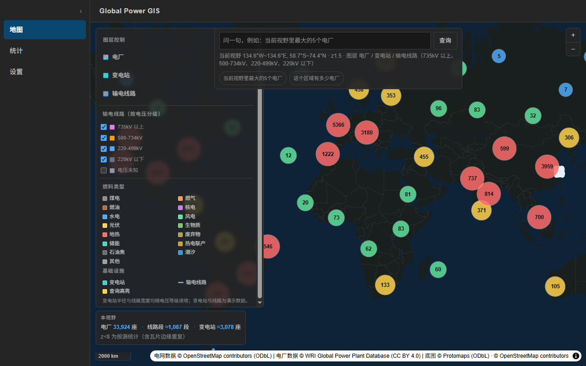
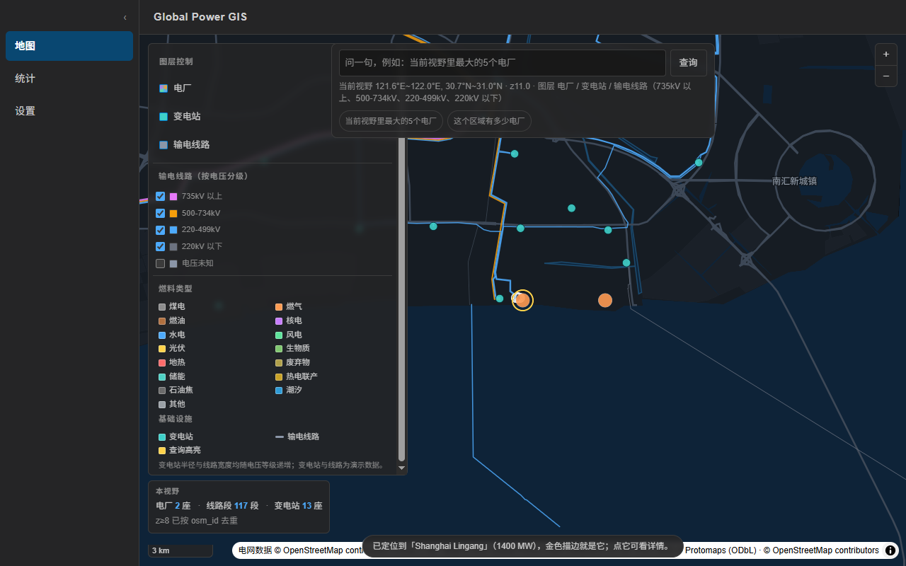
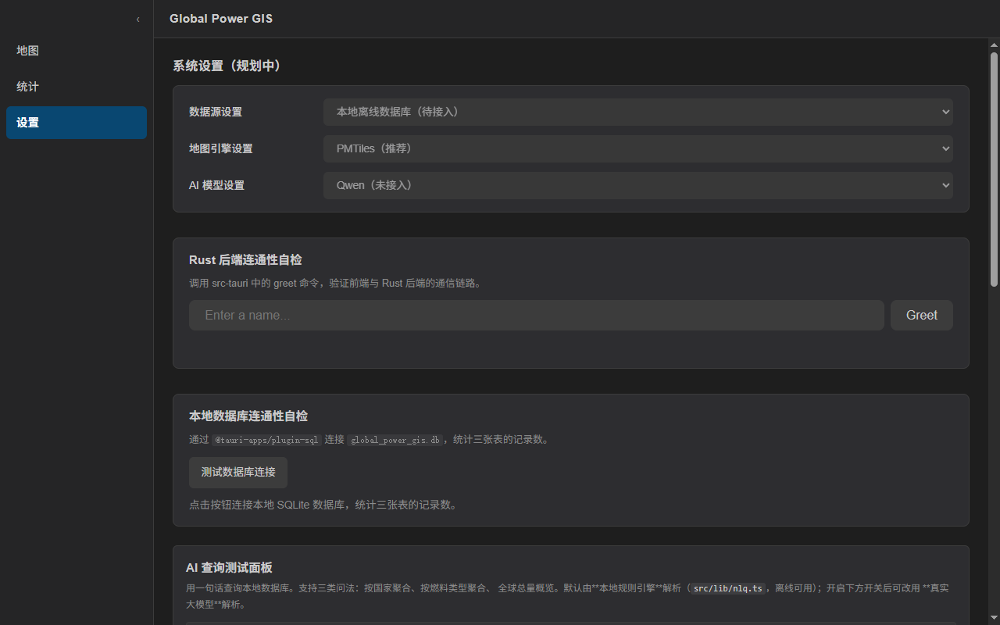
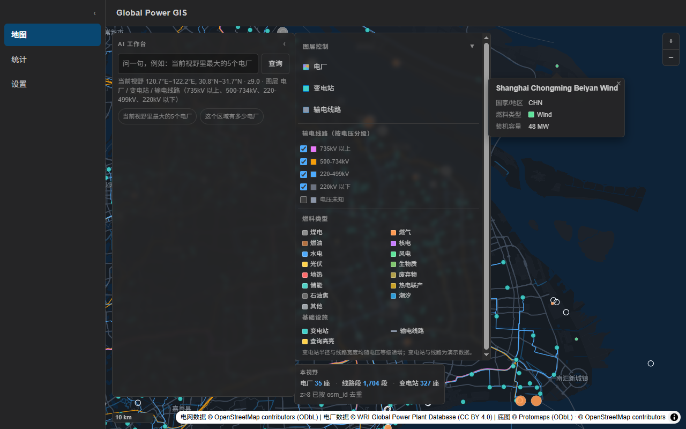
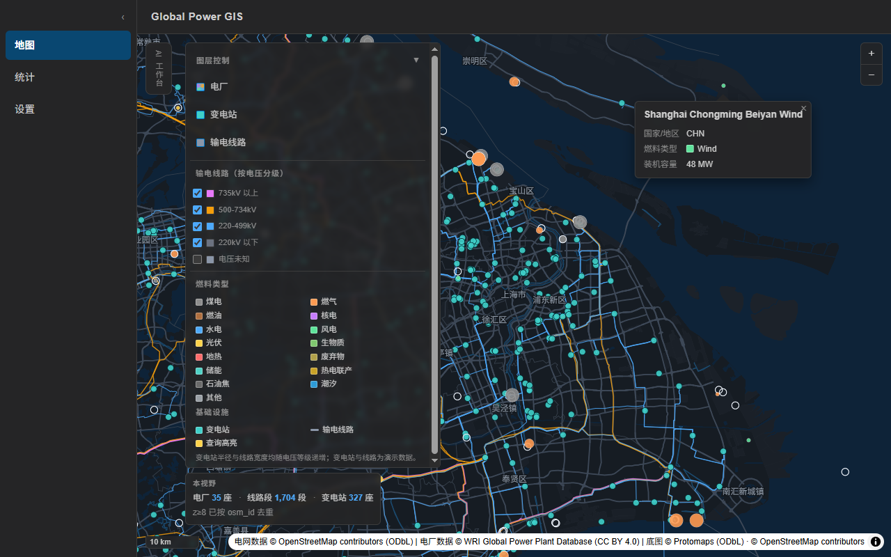
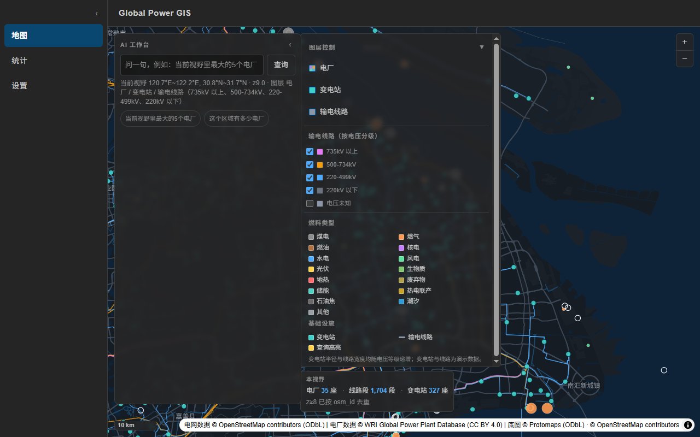
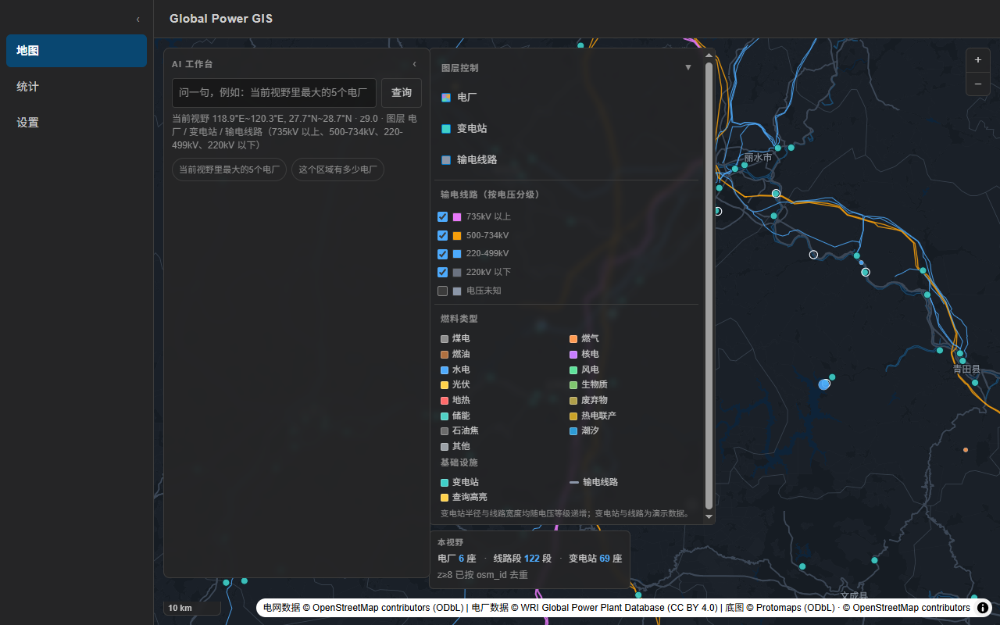

# OSM 电网数据：取数 → 合并 → 切片手册（阶段28–29）

本文件讲**数据怎么来、怎么切片、产物怎么被前端读**。

范围：**长三角**（`118,29,123,33`）—— 实测该范围内有 **15,524 条** `power=line` way。
跑通链路后可以用 `--bbox` 扩到别的区域，**不需要改任何代码逻辑**。

🔴 **阶段29 起彻底放弃 tippecanoe / WSL，改为纯 Node.js 切片**。
现在的完整链路（三条命令，无 Linux、无编译、无 Docker）：

```powershell
python scripts/fetch_osm_power.py --preset yrd --name yrd   # 取数（纯标准库）
node   scripts/prepare_osm_geojson.mjs --name yrd            # 合并三份 GeoJSON 并裁属性
node   scripts/build_pmtiles.mjs --name yrd                  # 切瓦片 → resources/maps/osm_grid.pmtiles
```

---

## 一、先看实测：本机工具链到底什么能用

阶段28 开工前把每条路都探过一遍（2026-09-12），别再重复试错：

| 路径 | 实测结果 |
|---|---|
| `download.geofabrik.de`（常规 OSM 抽取） | ❌ 8s 超时 |
| `download.bbbike.org` / `download.openstreetmap.fr` | ✅ 可达，但只给 `.osm.pbf`（需 libosmium 解析） |
| `maps.mail.ru`（公共 Overpass 镜像） | ✅ **24.1s 返回 362 条真实数据 → 现在用它作为首选端点** |
| `overpass-api.de` | ⚠️ 能返回数据，但**密集 504**；每次失败要退避 10/20/30s，实测把每块拖到 4–5 分钟。已降为备选 |
| `overpass.private.coffee` | ❌ 93s 读超时，基本不可用 |
| `overpass.osm.ch` | ⚠️ 1.4s 极快，但**返回 0 条** —— 它是瑞士专用实例，对中国数据无效。**「快 ≠ 可用」的典型** |
| `overpass.kumi.systems` / `overpass.osm.jp` / `overpass.openstreetmap.ru` | ❌ 超时/不可达，别再试 |
| `github.com` release 附件下载 | ❌ 20s+ 超时（`codeload.github.com` 源码包 **✅ 通，但很慢 ~27 KB/s**） |
| `tippecanoe` / `conda` / `mamba` / `scoop` / `osmium` CLI | ❌ 本机**全部不存在** |
| Docker | ❌ 未安装；且 `hub.docker.com` **不可达**，即使装了也拉不到镜像 |
| WSL | ⚠️ 组件在，但**没有安装任何发行版**（`wsl -l -v` 只打印帮助） |
| conda-forge 的 `tippecanoe` | ✅ 有 `linux-64/osx-64/osx-arm64/linux-ppc64le/linux-aarch64`，**❌ 没有 `win-64`** |
| npm 的 `tippecanoe` 包 | ❌ 只是个壳（README 明说 "You must install Tippecanoe separately"） |
| 清华镜像 `ubuntu` / `msys2` / `anaconda` / `pypi` | ✅ 全部可达 |

**结论：Windows 原生拿不到 tippecanoe，而 WSL 在本机已彻底损坏（阶段29 实测 DISM 0x800f081f 无法修复）。
所以改走纯 Node.js 切片**：`geojson-vt` 建瓦片索引 + `vt-pbf` 编码 MVT + 复用阶段26 已验证的
PMTiles 容器写入器。不需要 Linux、不需要编译、不需要 Docker。

---

## 二、第一步：抓数据（Windows 本机就能跑）

```powershell
# 只统计数量与电压分布，不落盘（先看规模）
python scripts/fetch_osm_power.py --estimate-only

# 正式抓长三角，产物落 data/osm/
python scripts/fetch_osm_power.py --preset yrd
```

脚本特性（都对着一堆坑写的）：

- **纯标准库**（urllib / json），不引入任何依赖。
- **分块抓取**：bbox 默认切成 4×4 = 16 块，每块 3 个查询（lines / substations / plants），
  块间 sleep 2 秒，失败重试 3 次并自动切换备用端点。
- **把 `remark` 一律当失败**。Overpass 出错时会返回 **HTTP 200 + `remark` 字段**
  （比如 `"runtime error: Query timed out"`），只看状态码会把失败当成功、静默丢掉整片区域。
  顺带一提：它的超时文案是 `timed out`（**带空格**），用 `"timeout" in remark` 匹配不到。
- **跨块去重**：相邻块会重复返回边界上的要素，按 `osm_id` 去重。
- **`power=line` 是按杆塔切碎的**（长三角 15,524 条），这是 OSM 的数据特征，不是 bug。
  线段首尾相接，视觉上看不出接缝，**本阶段不做合并**（合并涉及变电所边界、同塔双回方向
  连续性等拓扑问题，复杂度高且与「拿到真实数据并切片」无关）。

产物（都在 `/data/` 下，**已被 `.gitignore` 忽略**，不会污染仓库）：

```
data/osm/yrd_power_lines.geojson        1269+ 条 LineString，带 vclass / voltage_kv
data/osm/yrd_power_substations.geojson  Point，带 vclass / substation_kind
data/osm/yrd_power_plants.geojson       Point，带 plant_source
data/osm/yrd_power_meta.json            数量、电压分布、耗时
```

`vclass` 的取值就是前端要用的四档：`735+` / `500-734` / `220-499` / `<220`，外加 `unknown`
（实测长三角有约 22% 的线路没有 `voltage` 标签 —— 这是 OSM 的现实，不是解析 bug）。

---

## 三、第二步：装切片依赖（局部，不污染主项目）

依赖只装在 `scripts/` 下，**根 `package.json` 与 `src-tauri` 一个字节都不动**：

```powershell
cd scripts
npm install --save-exact geojson-vt@5.0.2 vt-pbf@3.1.3
```

- `geojson-vt`：**零运行时依赖**，把 GeoJSON 建成瓦片索引（v5 是 class，必须 `new`）；
- `vt-pbf`：把索引切片编码成 MVT，3 个极小传递依赖（`pbf` / `@mapbox/vector-tile` /
  `@mapbox/point-geometry`）；
- Node 从**脚本所在目录**向上找模块，所以 `node scripts/build_pmtiles.mjs` 会自动命中
  `scripts/node_modules`，不需要任何配置；
- `scripts/node_modules/` 已 gitignore；`scripts/package.json` 与 `package-lock.json` 进 Git 便于复现。

### 为什么不自己手写、也不引别的库

- **MVT 编码**交给 `vt-pbf`，绝不自写 protobuf；
- **PMTiles 容器**复用阶段26 已经验证过的写入器（`scripts/lib/pmtiles-writer.mjs`）。
  它产出的 1107 瓦片底图被官方 `pmtiles` 包读回校验通过，也真的被 MapLibre 用 Range 读过。
  官方 JS 包 `pmtiles` **只有解码器、没有 writer**（已核对其 `index.d.ts` 的导出清单，
  里面只有 `PMTiles` / `Protocol` / `Source` 这些读侧类型）；
- **不引入** `turf.js` / `d3` / 任何重型地理计算库。

### 明确排除的路径（省得你再试）

- **tippecanoe 的一切安装方式**：conda-forge 无 `win-64`；npm 包只是壳；
  GitHub Releases 下载在本机 20s+ 超时；
- **WSL**：本机 DISM 报 `0x800f081f`，修不动，不再浪费时间；
- **Docker**：未安装，且 `hub.docker.com` 不可达。


---

---

## 四、第三步：切片（一条命令）

```powershell
# 先试算：只统计各 zoom 的瓦片数与体积，不写文件
node scripts/build_pmtiles.mjs --name yrd --estimate-only

# 真切片（产物：src-tauri/resources/maps/osm_grid.pmtiles）
node scripts/build_pmtiles.mjs --name yrd
```

脚本做的事：

1. `geojson-vt` 建索引；
2. 按数据 bbox 枚举 z0..maxZoom 的候选瓦片，**空瓦片直接跳过**（电网很稀疏，这一步能省掉一大半体积）；
3. `vt-pbf` 编码成 MVT → gzip；
4. `buildArchive()` 组装 PMTiles v3（header + 元数据 + root/leaf 目录 + 瓦片正文）；
5. **自校验**：用官方 `pmtiles` 包读回，再用 `@mapbox/vector-tile` 真正解码，
   确认图层名与要素数对得上 —— 比「去浏览器里看一眼」可靠得多。

参数取舍（每个都有理由）：

| 参数 | 默认 | 为什么 |
|---|---|---|
| `--maxzoom` | 12 | 再深一级体积翻 3~4 倍；z12 之后交给 MapLibre 过缩放，矢量线过缩放仍然清晰 |
| `--tolerance` | 3 | 折线简化容差，越大越小越糊 |
| `--extent` | 4096 | MVT 网格精度，标准值 |
| `--min-features` | 1 | 默认只丢空瓦片，**不做抽稀** —— 电网是线要素，抽稀会把线路断开 |
| `--no-names` | 关 | 低级别瓦片里 `name` 会撑大字符串表，体积超标时再开 |
| `--layer` | `grid` | MVT 图层名，必须与前端 `OSM_GRID_SOURCE_LAYER` 一致 |

一个 MVT 图层装线 + 点两类几何，靠 `ftype` 区分 —— 这样前端的 `filter` 与阶段28 的
GeoJSON 版本**逐字相同**，换数据源不需要动任何图层样式。

---

## 五、产物放哪里（已定：`resources/maps/`，进安装包）

| 位置 | dev 可用 | 安装后可用 | 进 Git |
|---|---|---|---|
| `src-tauri/resources/maps/osm_grid.pmtiles` ✅ 当前方案 | ✅ | ✅ | ❌（gitignore） |

- `tauri.conf.json` 的 `bundle.resources` 已加入该文件 → 会被拷进安装包；
- `assetProtocol.scope` 已经是 `["$RESOURCE/maps/**"]`，**无需改动**；
- CSP 的 `connect-src` 已含 `asset:`，**无需改动**；
- 代价：全新克隆必须先跑一次切片脚本（与底图 `basemap.pmtiles` 同样的约定）。

---

## 六、前端怎么读（阶段29 已实现）

1. `addProtocol("pmtiles", protocol.tilev4)` —— **全局只能注册一次**，底图与电网瓦片共用；
2. `protocol.add(new PMTiles(url))` 为每份归档注册实例，样式里写 `pmtiles://<key>/{z}/{x}/{y}`；
3. 127 字节 Range 探针确认 `206`；不支持时退回整包读内存，并明确告警；
4. ⚠️ **必须写 `tiles:` 而不是 `url:`** —— 用 `url:` 会去取 TileJSON，而它的 `bounds` 是归档 bbox，
   缩到全球视野时瓦片会被裁掉（阶段26 踩过）；
5. 图层用 `"source-layer": "grid"`，`filter` 与阶段28 的 GeoJSON 版本**逐字相同**，
   所以「变电站 / 输电线路」两个开关不需要任何改动就自动生效；
6. 归档缺失时**优雅退回**上海小样本 GeoJSON 并弹出提示，开发者体验不至于崩掉。

---

## 七、阶段29 实测数据（2026-09-13）

### 输入（长三角 `118,29,123,33`）

| | 要素数 | 文件 |
|---|---|---|
| 输电线路 | 18,682 | 11.62 MB |
| 变电站 | 3,078 | 0.79 MB |
| 电厂 | 620 | 0.17 MB |
| **合计** | **22,380** | **12.58 MB** |

抓取：20 个分块，首选端点 `maps.mail.ru`；`complete=true`、`failed_chunks=0`。

⚠️ **数据实际范围是 `109.9–122.7°E / 28.6–36.1°N`，比指定 bbox 大不少。**
原因：Overpass 返回与 bbox **相交**的整条 way 及其完整几何，所以几条跨省特高压直流线路
（实测含 `昌吉—古泉±1100千伏特高压直流输电线路`）被完整带进来。
**这是有意保留的**——真实电网不顺着行政区划走，为了 bbox 整齐去截断线路反而是错的。

### 切片（`node scripts/build_pmtiles.mjs --name yrd`）

| 指标 | 实测 |
|---|---|
| 坐标点 | 260,084 |
| 建索引 + 生成瓦片 | **0.1 s + 1.2 s**（无内存问题，不需要 Docker） |
| 瓦片数 | 3,757（自动跳过 **16,371** 张空瓦片） |
| 归档体积 | **4.68 MB**（MVT 原始 8.96 MB → gzip 4.67 MB，压缩比 1.9x） |
| 最大单瓦片 | **233 KB 原始 / 91 KB gzip**（z6，11,318 要素） |

**低级别精简属性（`--full-props-from 8`）的效果——这一步是必需的，不是锦上添花：**

| | 优化前 | 优化后 |
|---|---|---|
| 最大单瓦片（原始） | 522.8 KB ❌ 超 500 KB 经验上限 | **233.1 KB** ✅ |
| MVT 原始总量 | 11.08 MB | 8.96 MB |
| 归档体积 | 5.37 MB | **4.68 MB** |

根因：低级别单张瓦片会把**上万条**要素装进去，而 `osm_id` 几乎每条都不同
→ MVT 字符串表被撑到上万条唯一值。而前端 `filter` **只用 `ftype` 与 `vclass`**，
所以 z<8 丢掉 `name`/`osm_id`/`voltage_kv` 是**纯收益、零渲染损失**；
z≥8 完整保留（放大后点选弹窗要用）。

### 前端渲染验收（应用内，每次截图前都校验视野已对齐）

| 检查项 | 结果 |
|---|---|
| 归档加载 | `离线电网瓦片就绪（Range 读取）… z0-12，3,757 个瓦片` |
| z10.5 `queryRenderedFeatures` | 735kV 0 / 500-734 55 / 220-499 204 / <220 21；变电站 67；电厂 11 |
| z8.5 `queryRenderedFeatures` | 67 / 615 / 1669 / 611；变电站 858；电厂 145 |
| 关「输电线路」 | 橙 4423→**1235**、蓝 15151→**6375**；画面差异 **18,743 px** |
| 关「变电站」 | 青 110→**21**；画面差异 5,402 px |
| 恢复后重拍 | 合计完全相同，**噪声基线 0 px** |
| 地图交互帧间隔 | 中位数 **16.7 ms（≈60 fps）**，p95 17.0 ms |
| 控制台 | 零错误零告警 |

**验收方法学（踩过坑，值得记）**：CDP 合成的**拖拽**在本机 WebView2 里不可靠
（缩放按钮的合成点击有效、mousedown+move+up 无效），所以导航改用 `map.jumpTo()`；
而「图层到底画出来没有」用 **`map.queryRenderedFeatures({layers:[id]})`** 按图层统计要素数，
比肉眼看截图硬得多。曾因为验收脚本**截图前没重新对齐视野**，得到「请求 zoom 10.5 却停在 7.32」
且噪声基线高达 49 万像素的假结论 —— 现在每次截图前都会校验视野（连续两次读数一致）
并打印真实视野，对不上就照实报告，绝不用「我以为的视野」写结论。

## 八、阶段30 实测数据（2026-09-13）

主题：输电线路按电压分级开关 + 当前视野数据统计面板。

### 分级开关（原生 `<input type="checkbox">`，键直接用 `vclass`）

| 动作 | 实测结果 |
|---|---|
| 默认状态 | 4 档勾选、**「电压未知」不勾选**；总开关显示为开 |
| 勾上「电压未知」 | 该层 `visibility` 由 `none` → 可见，`queryRenderedFeatures` **0 → 23 条**；统计 265 → **283 段** |
| 再关掉 | 渲染数归零、统计回到 265 段；与默认截图**差异 0 px**（完全可逆） |
| 只关「220-499kV」 | 该层渲染数 **归零**、500-734kV 不受影响；统计 265 → **73 段** |
| 点「输电线路」总开关 | 5 档全部 `none`、线路段**归零**；变电站不受影响；再点一次 5 档全开（含电压未知） |

### 统计面板口径（用户明确要求的取舍）

- 用 **`queryRenderedFeatures`** 而不是 `querySourceFeatures`：后者会把视野外瓦片缓冲区里的
  要素也算进来，数值偏大且与复选框脱钩。
- **电厂走 SQL bbox `COUNT(*)`**：电厂是聚合图层，按要素求和会把聚合体内的电厂重复计数。
- 跨瓦片重复：z≥8 瓦片带 `osm_id` → 按它去重（精确）；z<8 为压体积未保留 `osm_id` →
  无法去重，数值前加 `≈` 并标注「z<8 为按源统计」（**实测字号 12px = 0.75rem**）。
- 实测数字与阶段29 的独立读数**完全一致**（z10.5：735kV 0 / 500-734 55 / 220-499 204 /
  <220 21 / 站 67 / 厂 11），换视野后 265 段 → 苏州 549 段·123 站 → 苏北 z8.2 0 段·0 站
  → z7.2 `≈711 段 ≈132 站`。

### 🔴 性能：50ms 护栏与迁移 v5

统计每次要同时做「渲染查询」和「SQL 计数」，实测拆开看：

| 阶段 | 总计（67 次采样，含 20 次连续移动压力） | 渲染查询 | 数据库 |
|---|---|---|---|
| 加索引前 | min 12.1ms / **max 49.1ms** | 0.2 ~ 18.6ms | **10.8 ~ 38.7ms** |
| 加索引后（v5） | min 6.0ms / max 46.1ms | 0.3 ~ 35.2ms | **4.9 ~ 18.9ms** |

两次都是 **0 次超 50ms**，但余量只有 0.9ms。根因不是算法而是**缺索引**：
`power_plants`（34,936 行）上没有任何索引，每次 `COUNT(*)` 都全表扫。
迁移 `005_index_plants_latlon.sql` 加了 `(lat, lon)` 索引后，SQLite 查询计划变成
`SEARCH power_plants USING COVERING INDEX idx_power_plants_lat_lon (lat>? AND lat<?)`，
Python 侧同样语句 **10~38ms → 0.07ms**。

应用内「数据库」段仍显示 4.9~18.9ms，是因为那一项包含了**前端→Rust 的 IPC 往返**，
SQL 本身已经是 0.1ms 量级 —— 这是本期最容易被误读的一个数字。

⚠️ **不重新生成 `seed/global_power_gis.db`**：迁移会在首次启动时自动补上索引，
没必要为一个索引提交 3 MB 二进制差异。

### 顺手修掉的两个真缺陷（都是量出来的，不是看出来的）

1. **左侧两个面板重叠 54px**，图例「基础设施」整段被统计面板盖住。
   根因：`App.css` 的全局 `line-height: 1.5`（=24px）落到 0.7rem 的小行上，
   等于「字形 11px、行框 24px」，每行白多出 8px；5 个电压档 + 15 个燃料类型叠起来就是上百像素。
   面板内行高收紧到 1.4 后：图层面板 610px、统计面板 75px、**间隙 +7px**。
2. 统计面板 `flex-wrap` 折成两行（92px → 75px）。

教训：面板高度别靠估，直接量 `getBoundingClientRect()` 与 `getComputedStyle()` ——
一开始我按「0.65rem 标题 + 0.75rem 正文」估出 72px，实测是 92px，差的就是全局行高。

## 九、阶段31 实测数据（2026-09-13）

主题：把「当前视野」作为空间上下文注入自然语言查询。

### 关键设计：模型只回答「要不要限定」，坐标由程序注入

模型输出里的 `inViewport` 是个**布尔值**，四个坐标一律取自 `map.getBounds()` 的快照。
这样提示词注入与模型幻觉都不可能把查询框挪到别处，也不可能拼出非法 SQL。

### 实测（应用内，本地规则引擎路径，确定性、不需 API Key）

| 检查项 | 结果 |
|---|---|
| 上下文读数 vs 地图实测 | `120.7°E~122.2°E, 30.8°N~31.7°N · z9.0` 与 `getBounds()` 逐位一致 |
| 「当前视野里最大的5个电厂」 | SQL 出现 `lon BETWEEN ? AND ? AND lat BETWEEN ? AND ?`，参数 = 视野四至（`120.726363, 122.213637, 30.788028, 31.669915`） |
| 同一问法换到北京 | 结果集完全不同（上海 5 座 → 北京 5 座），说明用的是实时快照 |
| 视野移动后 | 表格消失、高亮要素数归零、提示「视野已移动：上次「当前视野」查询的结果已清空」 |
| 反例「全球前10大电厂」 | SQL **无** `BETWEEN`，返回三峡/白鹤滩/溪洛渡/苏尔古特-2/古里，且仍会飞行定位 |
| 地图高亮 | `queryRenderedFeatures({layers:['highlight-points']})` = 5 |
| 控制台 | 零错误零告警 |

### 独立交叉验证（Python 直连 SQLite，不信任应用自报的结果）

- 上海 / 北京两次返回的每一个电厂，都能在库里找到落在该 bbox 内的坐标点；
- 用独立 SQL 重算「视野内 Top5」，与应用的返回**完全一致**；
- 上海视野内 Top5 与独立算出的全球 Top5 **零重叠** → 证明约束真的改变了答案；
- 「全球前10大电厂」的 5 个结果**全部**在北京视野之外 → 证明该取消时确实取消了。

### 踩坑
- CDP 的 `Input.insertText` 是**追加**而不是替换：连续提问时上一句会留在输入框里，
  被拼成完全不同的问法。验收脚本必须先 `Ctrl+A` 全选再输入。（第一次跑就因此得到假失败）
- 带视野限定的查询**不能**再调 `fitBounds`：`padding` 会把视野收窄，而视野一变，
  刚得到的结果会立刻被自己的「过期检测」清掉。现在这类查询只高亮、不移动地图。

### 真实大模型实测（2026-09-13）

本机保存的 provider 是 **Ollama（本地 qwen2.5:7b）**，没有云端 Key，所以实测走的是
真实本地模型（零云端额度消耗）：

| 提问 | 模型自己判定 | 实际 SQL | 结果 | 耗时 |
|---|---|---|---|---|
| 当前视野里最大的5个电厂 | 输出 `inViewport: true` | 带 `lon/lat BETWEEN ? AND ?`，参数 = 视野四至 | 5 座上海机组 | 7s |
| 当前视野里最大的5个电厂**是哪些** | 输出 `inViewport: true` | 同上（参数 = `120.726363, 122.213637, 30.788028, 31.669915`） | 同样 5 座 | 5s |
| 全球前10大电厂 | **未**输出 inViewport | **无** `BETWEEN` | 三峡 / 白鹤滩 / 溪洛渡 / 苏尔古特-2 / 古里 | 2s |

🔍 **「全球前10大电厂 未输出 inViewport」是正确行为，不是模型没理解**：
该问法没有任何空间指代，本来就**不应该**被限在视野内 —— 它正是用来验证
「该取消约束时能取消」的反例。若它也被加上 `BETWEEN`，才是真正的缺陷（会把
全球排名悄悄变成“这一屏的排名”）。加上视野约束后，结果确实落在窗口内这一点，
另用 Python 直连 SQLite 独立复核过：5 座电厂的坐标点全部在该 bbox 内，
且与独立 SQL 算出的「视野内 Top5」逐项一致。

说明文字以「由 AI 解析：」开头 —— 这是区分大模型链路与本地规则引擎链路的可靠标志
（本地引擎不会加这个前缀）。想跑云端（DeepSeek / Qwen / GLM）只需在设置页填入
API Key 再问同样两句，SQL 通路与断言完全一致。

⚠️ 另记一笔观测：冷启动、瓦片还在解析时，视野统计出现过一次 **175.7ms** 的超护栏告警
（稳态 67 次采样 max 46.1ms、0 次越线）。与之前 HMR 重挂载时的尖峰同类，
属于启动阶段的争用，不是算法问题；但如实记录，不当作“没发生过”。

### 冷启动统计面板补丁（阶段30 遗留缺陷，阶段31 收尾时修掉）

现象：**冷启动后不碰地图**，左下「本视野」面板会停在「线路段 0 段 · 变电站 0 座」
且不会自纠。根因：地图「就绪」只说明图层与数据已挂上，不代表瓦片已经画出来 ——
挂载时那次 `queryRenderedFeatures` 跑在瓦片渲染之前，自然数到 0。

修法（一行 + 一行守卫）：统计 effect 里补 `map.once("idle", schedule)`，
地图首次真正空闲后再补跑一次；`run()` 开头加 `if (cancelled) return;` 防止卸载后碰地图。

实测（**全新进程**冷启动，验证脚本全程未移动地图）：
`电厂 33,924 座 · 线路段 ≈1,087 段 · 变电站 ≈3,078 座` ✅（修复前这里是 0 / 0）；
随后移动地图仍照常刷新：`电厂 35 · 线路段 1,704 · 变电站 327` ✅



⚠️ 阶段30 的验收脚本每次都「先 settle 移动地图再读数」，正好绕过了这个窗口 ——
是验收设计的缺口，不是巧合。这次才把它抖出来。

## 十、阶段32 实测数据（2026-09-13）

主题：AI 查询结果与地图的双向联动（点击结果行 → 飞过去 + 单点高亮）。

### 🔴 核心教训：别把 `getBounds()` 当成「用户看到的范围」

地图页被切走后容器变成 `display: none`，MapLibre 会把 transform 尺寸更新为 0，
此后 `map.getBounds()` **不再等于用户看到过的范围**：

| | 数值 |
|---|---|
| AI 实际收到的 bbox | `121.195~121.745, 31.054~31.406`（0.55° × 0.35°） |
| 地图实测 `getBounds()` | `120.726~122.214, 30.788~31.670`（1.49° × 0.88°） |
| 后果 | 上海 z9 视野内 **35 座**电厂，只回了 **6 座**（真实 Top10 里的 Shidongkou 与两条 Lingang 全丢） |

修法：改由「相机中心 + 缩放 + **缓存的容器尺寸**」用 Web Mercator 自行推导 bbox
（`boundsFromCamera()`，与 MapLibre 内部算法一致）；容器尺寸为 0 时沿用最后一次有效值，
可见时以真实尺寸自愈；并在 `map.on("resize")` 时重算刷新。零新依赖。

⚠️ 这也暴露了阶段31 验收的缺口：当时只断言「SQL 参数 == `getBounds()`」（自洽），
**从没验证 `getBounds()` 是否等于用户真正看到的范围** —— 而「当前视野」这个功能的
全部价值都压在这个等式上。

### 同名电厂：为什么选中行必须用 (name, lat, lon) 三元组

`Shanghai Lingang` 在库里对应两条不同坐标的记录（lon 121.83 与 121.79），只按名字匹配必然点错：

| 动作 | 实测 |
|---|---|
| 点第 1 条 | 地图中心 121.83 / 30.85，偏差 **0.00000°**，高亮 1 |
| 点第 2 条 | 地图中心 121.79 / 30.85，偏差 **0.00000°**，高亮 1 |
| 两次落点相距 | **3.812 km**（确实是两个不同的点） |

### 切页状态保留

`地图 → 统计 → 地图` 后金色高亮与定位提示仍在；切到设置页后表格 10 行、选中行均保留。
（此前会读到 null：根因是「无视野限定的查询」被误设成受监视状态，随手一动就被判过期清空。）





## 十一、阶段33 实测数据（2026-09-13）

### 🔴 核心：LLM 路径缺「指代继承」，追问会静默丢掉地理约束

实测 SQL（Ollama `qwen2.5:7b`，本地）：

| 问题 | SQL |
|---|---|
| 第一问「当前视野最大的电厂」 | `... WHERE lat IS NOT NULL AND lon IS NOT NULL AND lon BETWEEN ? AND ? AND lat BETWEEN ? AND ? ORDER BY capacity_mw DESC LIMIT ?`（5 个参数） |
| 追问「那最大的5个水电站呢？」（**修复前**） | `... WHERE lat IS NOT NULL AND lon IS NOT NULL AND primary_fuel = ? ORDER BY capacity_mw DESC LIMIT ?` —— **没有 `BETWEEN`**，退回全球查询（返回 Three Gorges / Baihetan / Xiluodu / Guri / Tucuruí） |

根因：本地规则引擎 `parseNaturalQuery` 里有指代继承逻辑，但 **LLM 路径的 `toParseResult` 只认模型输出的布尔 `inViewport`**；
实测 7B 模型在追问时经常不输出这个字段，于是静默退回全球查询。

修法：在 `toParseResult` 内按与本地引擎**相同的判定**补一条确定性继承 ——
出现指代词（那…呢 / 还是 / 同样 / 那么 / 这个 / 这些）+ 上一轮带视野 + 本轮未换国家 →
继承**上一轮**的视野（继承的是「上一轮答案的框架」，不是当前地图状态）。

### 实测（修复后）

每次截图前都等到「出现新的 `[aiQuery] SQL` 行」这一确定性信号，不靠表格行数猜：

| 问题 | SQL 关键片段 | 行数 | 高亮 | 耗时 |
|---|---|---|---|---|
| 当前视野最大的电厂 | `lon BETWEEN ? AND ? AND lat BETWEEN ? AND ?` | 1（Waigaoqiao / Coal / 5240MW） | 1 | 7s |
| 那最大的5个水电站呢？ | 仍带 `BETWEEN` **且** `primary_fuel = ?` | 0 | 0 | 4s |
| 那最大的5个火电厂呢？ | 仍带 `BETWEEN` **且** `primary_fuel = ?` | 5（全 Coal） | 5 | 4s |

追问时地图视角**不动**（限定视野的查询跳过 `fitBounds`），状态栏：`已高亮 N 个匹配的电厂（限定当前视野）（金色描边）`。
追问发起瞬间旧表格即清零（0.6s 采样行数 = 0），无视觉残留。

### Python 独立复核（直连 SQLite，不信任前端自报结果）

- 前端返回的每一行，都能在库里按 (name + primary_fuel + bbox) 命中 1 行
- 独立算出视野内最大电厂 = `Waigaoqiao power station / Coal / 5240 MW`，与前端一致
- 视野内 `Hydro` 计数 = **0** → 追问返回 0 行是**真值**；对照组：全库水电 **7156** 条，排除「数据缺失」
- 独立算出的视野内 Coal Top5 与前端**逐名一致**；与全局 Coal Top5 **零重叠**（证明视野限定确实起了作用）

### 左侧智能工作台

- 可折叠：折叠后只剩竖向导轨（`.rail`，`writing-mode: vertical-rl`），图层面板 `left` 由 352px 归位；点导轨恢复输入框
- 历史显示「对话历史（N 轮）」+ 每条的问与 AI 解析；默认最近 5 轮 +「展开更多（全部 N 轮）」

### 验收脚本自身踩的坑（记下来省得再犯）

- 忘了发 `Runtime.enable` → 一条 console 事件都收不到 → SQL 永远读不到，等待条件永不满足，每问空转 180s，最后连日志都没写成。
  **等待查询完成要用「新的 SQL 行出现」这种确定性信号，不要用表格行数变化去猜。**
- 燃料列显示的是原始值 `Hydro`，脚本却去比对中文「水电」→ 假失败
- 折叠判定写成「`section` 元素是否消失」→ 假失败（折叠后 `section` 仍在，只是内部只剩导轨）；应判「导轨出现 **且** 输入框消失」
- 高亮数量不要用图层计数（时序不稳），读状态栏文案最稳


## 十二、阶段36 实测数据（2026-09-13）

### 关键指标

| 项 | 实测 |
|---|---|
| 弹窗 DOM 父节点 | `.viewport`（修复前在地图容器内，被堆叠上下文困住） |
| 弹窗计算样式 `z-index` | `10` |
| 弹窗矩形内采样点命中自身 | **9 / 9**（修复前 6/9） |
| 图层面板 `left` | 折叠前 352px → **110ms 中间态 112.626px** → 终态 64px |
| `transition` | `left 0.22s ease` |
| 统计数字动画 | `_statPop_1rvwk_1`（CSS Modules 加前缀）、`0.28s`、刷新瞬间 `opacity 0.55`、`running=1` |
| 控制台 | error / 异常 = **0** |
| `npm run build` | exit **0** |

### 🔴 核心：单纯给弹窗加 `z-index` 是**无效**的

`.mapContainer` 是 `position:absolute; z-index:0` —— 它自己形成一个**堆叠上下文**，
作为它后代的弹窗 `z-index` 再大，也只能在这个上下文**内部**比较，
永远压不过兄弟节点上的浮动面板（`.layerPanel` z-index:1、AI 工作台 z-index:2）。
反过来把 `.mapContainer` 提到面板之上也不行：不透明的画布会把面板整个盖掉。

**修法**：在 `popup` 的 `open` 事件里把弹窗 DOM **搬到 `.viewport`**（与面板同级），再由 CSS 抬到 `z-index: 10`。
搬家不改位置的原因：`.mapContainer` 是 `inset:0`，与 `.viewport` 原点完全重合，
所以 MapLibre 写在元素上的 `transform: translate(...)` 不需要任何换算。
挂在 `open` 而不是每个点击处理里，一处就能覆盖全部 5 个弹窗来源。

### 折叠动画：先纠正「地图视窗平滑扩展」的事实

地图容器是 `inset:0`，**一直全宽**，折叠不会让画布变大；变化的只是被面板盖住的面积。
所以落地为「左侧两个面板平滑位移」，并顺手修掉一个真 bug：
折叠后面板原本停在 12px，会与宽约 32px 的竖向导轨**重叠** —— 现在 `.railOnly` 把它推到 64px。

bbox 不受影响：`boundsFromCamera()` 用的是容器尺寸（折叠不变）+ 中心 + 缩放；
地图没有移动，所以也不会误触发阶段31 的「视野变了就清结果」。

### 统计数字过渡（纯 CSS，零依赖）

不做「数字滚动」：那需要 JS 逐帧插值（等于自带一个小动画库），
而统计每 200ms 防抖刷新一次，滚动动画会互相打断、反而更花。
改用 `key={值}` 触发节点重挂 + `@keyframes statPop`（0.28s 淡入 + 1px 位移 + 0.96 缩放），
配合已有的 `font-variant-numeric: tabular-nums` 不抖动，并加 `prefers-reduced-motion: reduce` 降级。

### 验收脚本自身踩的坑（记下来省得再犯）

1. `‹` 这个折叠箭头**侧边栏也在用**（阶段9 定的），全局找按钮会点到侧边栏 ⇒ 表现为「折叠没发生」。
   必须限定在 `section[aria-label="地图查询"]` 内找。
2. MapLibre 弹窗有**外围透明留白**（给小三角的位置），那部分按设计不接收点击 ⇒
   采样必须用 `.maplibregl-popup-content`，拿外层 `.maplibregl-popup` 会得到假失败。
3. CSS Modules 会给 `@keyframes` **加模块前缀**（实测 `_statPop_1rvwk_1`）⇒ 断言只能做包含判断。
4. 验收脚本的模板字符串里**不能用反引号写注释**，会提前截断字符串（实测报 `popup is not defined`）。





## 十三、阶段37 实测数据（2026-09-13）

本节记录三件事：**区域重叠的真实规模**、**asset 协议 Range 是否真的生效**、**归档体积与安装包体积**。

### 关键指标

| 项 | 实测 |
|---|---|
| 长三角要素数 | 22,380 |
| 浙江要素数 | 15,490 |
| 合并后要素数 | **25,611** |
| 去重丢弃（重叠） | **12,259**（占输入 32.3%） |
| 归档瓦片数 | **4,717**（z0–z12） |
| 归档体积 | **gzip 5.53 MB** |
| 真实归档 HTTP 请求 | **9 / 9 = 206**，全部带 `Range` 头 |
| 其中非头部区间请求 | `Range=bytes=22422-42380`（`osm_grid.pmtiles`） |
| 请求 URL | `http://asset.localhost/D%3A%5C…%5Cmaps%5C…pmtiles`（走 asset 协议，未退回内存兜底） |
| 控制台 error | **0** |
| `npm run build` | exit **0** |

### 🔴 教训一：「URL 里含 pmtiles」不是「这是归档请求」

验收脚本里用「URL 含 `pmtiles`」筛网络条目，结果混进一条 **200**，一度被当成
「Range 没生效、退化成整包读取」的证据。把**完整 URL + `content-type`** 打出来立刻定性：

```
只算真实归档文件（URL 里有 .pmtiles）：条目 9 条，状态分布 {"206":9}，无 Range 的 0 条
非归档文件但 URL 含 pmtiles：
  · 200  ct=text/javascript  http://localhost:1420/node_modules/.vite/deps/pmtiles.js?v=…
```

它是 **Vite 预打包的 `pmtiles.js` JS 模块**，本来就不该有 Range。
**结论：过滤条件必须基于 `content-type` 或明确的归档 URL 前缀，不能只看路径里有没有那个词。**

### 教训二：取证必须落盘再读

本机终端在**长驻后台进程存在时**会吞掉 sync 命令输出；而 PowerShell 的 `*>` 重定向
默认写 **UTF-16LE**，用文本读取工具打开会得到二进制。
可行组合：**命令只负责跑 + 重定向到文件，由脚本自己 `fs.appendFileSync(..., 'utf8')` 写日志，再用文件读取工具打开**。

### 🔴 教训三：重叠不是「小误差」，是三分之一

最初担心两片区域在省界处"接缝重叠"，实测**12,259 / 37,870 = 32.3%**。
所以**合并必须按 `osm_id` 去重**，不能靠"尽量别重叠"的网格切分规避 ——
`merge_osm_regions.mjs` 就是为此而写（纯 Node 标准库，零依赖）。

### 架构层面：为什么前端一行都没改

合并后的产物**写回前端既有资源路径** `osm_grid.pmtiles`，命名、source、图层 ID 全部不动 ⇒
阶段29–36 的全部验收结论继续成立（单 source、按电压分级 5 个图层、点击弹窗）。
浙江片转为**可选数据包**：`osm-zhejiang.pmtiles`（3.48 MB）**从 `bundle.resources` 移出**。

### 体积账

| 组成 | MB |
|---|---|
| basemap.pmtiles | 31.76 |
| osm_grid.pmtiles（合并核心区） | 5.53 |
| seed DB | 2.98 |
| 可执行文件 | 10.77 |
| **安装器合计** | **≈ 54.6** |

`build_pmtiles.mjs` 增加了一条防手滑：**未显式传 `--out` 时告警**，避免默认路径被静默覆盖。

### 视觉验收（南浙江由「空白」变为有数据）

两张截图为同一归档、同一构建的连续视野；统计数字均为**已按 `osm_id` 去重**后的本视野计数。

长三角（z=8，120.7–122.2°E / 30.8–31.7°N）：**线路 1,704 段 · 变电站 327 座 · 电厂 35 座**



浙南丽水/青田（z=8，118.9–120.3°E / 27.7–28.7°N）：**线路 122 段 · 变电站 69 座 · 电厂 6 座**
（合并浙江前此视野为空白 —— 这正是"长三角片单独存在"时缺少的那一块）



